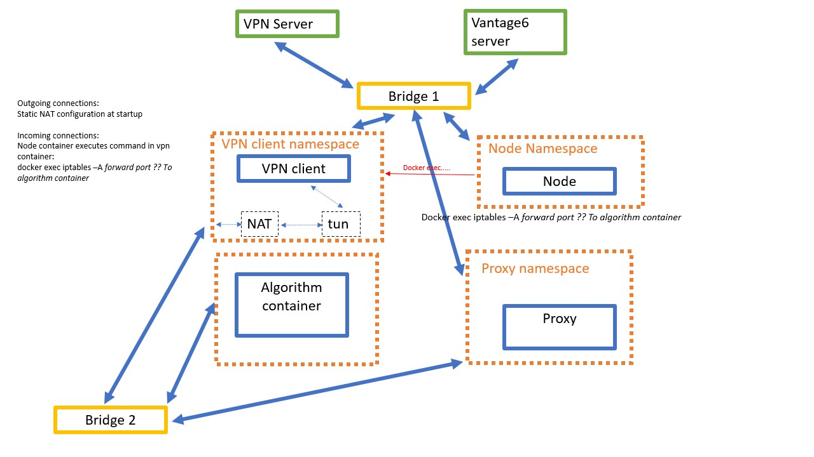

# algorithm-container-network
Experimental setup for peer-to-peer network for algorithm containers with port forwarding



## How to run
```bash
docker-compose up -d
```

## Notes
### Additional configuration
Blocking internet for vpn clients (this will run automatically on vpn client):
```shell
iptables -F FORWARD
iptables -P FORWARD DROP
iptables -A FORWARD -i tun+ -o eth1 -j ACCEPT
iptables -A FORWARD -i eth1 -o tun+ -j ACCEPT
```

On docker host, configure exception to docker bridge network isolation:
```shell
iptables -I DOCKER-USER 1 -d $vpn_subnet -i $isolated_bridge -j ACCEPT
iptables -I DOCKER-USER 1 -s $vpn_subnet -o $isolated_bridge -j ACCEPT
```

Configuring routing in algorithm container namespace from host.

_TODO: Maybe execute this in separate net-admin container that resides in algo-container namespace_
```shell
pid=$(docker container inspect $container_id -f '{{.State.Pid}}')
mkdir -p /var/run/netns/
ln -sfT /proc/$pid/ns/net /var/run/netns/$container_id

ip netns exec $container_id ip a

ip netns exec $container_id ip route replace default via $gateway
```

## Openvpn server requirements
- `blockLan = false`
- `clientToClient = true`

## References
* [How to share networks between docker containers](https://forums.docker.com/t/how-to-set-up-containers-with-vpn-client-installed-each-connecting-to-another-vpn-server/97549)
